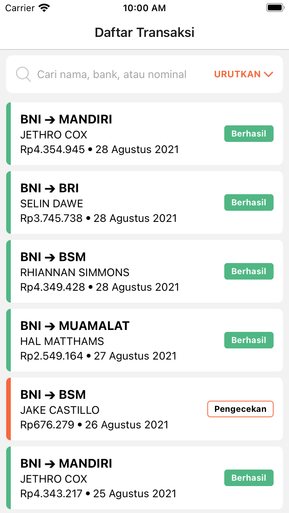
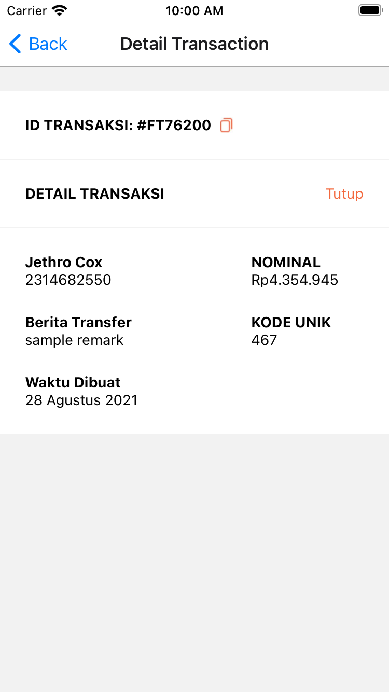
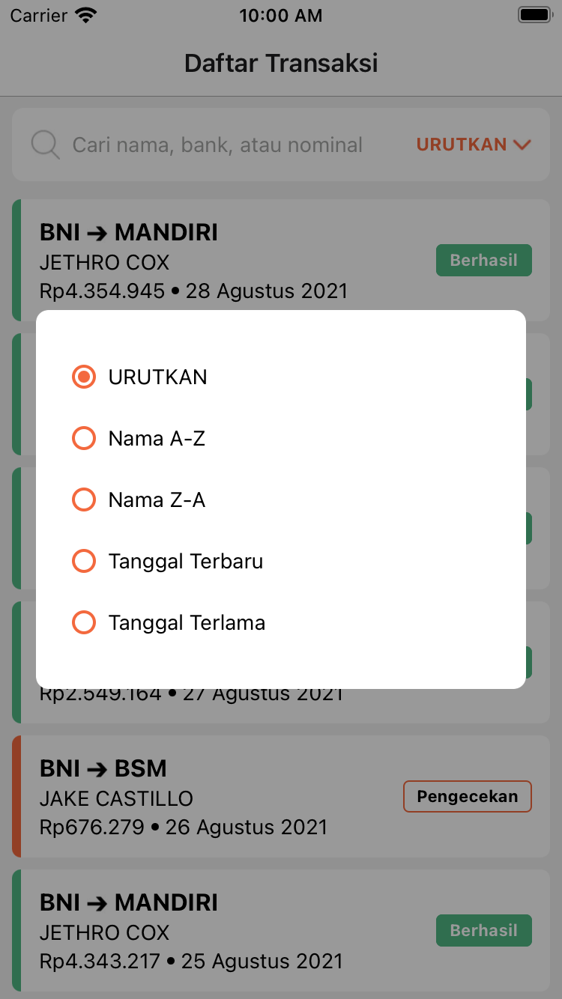
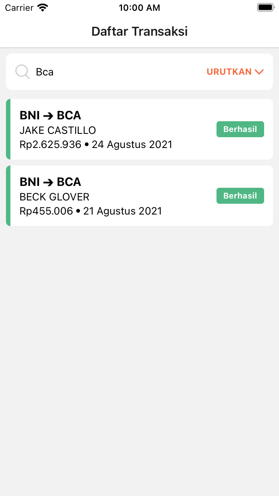

# Flip Transaction

 - it has list of transactions
 - it can be searched or filtered by 
   - name
   - sender bank
   - beneficiary bank
   - transaction's amount
 - it can be sorted by
   - name A-Z
   - name Z-A
   - date newest
   - date oldest

## Screenshot

